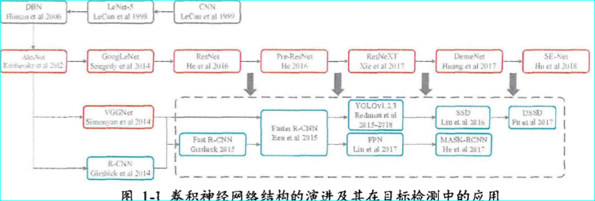
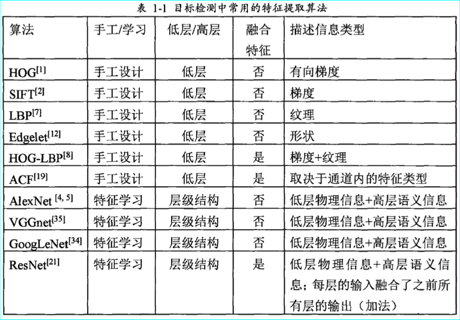
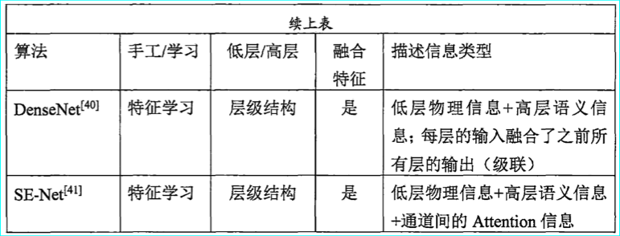
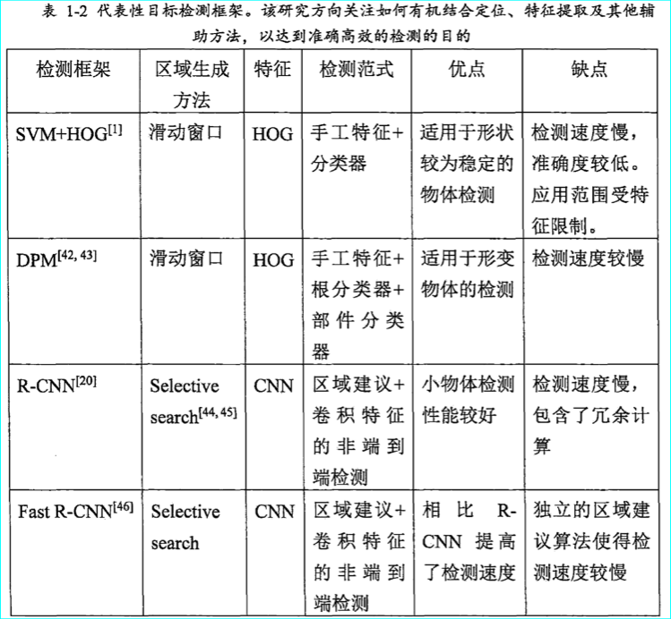
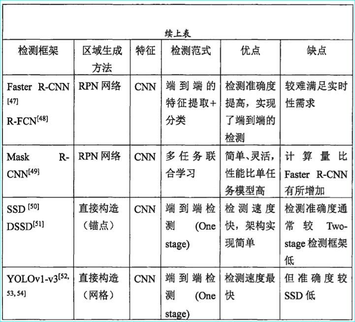

### 特征提取算法

* 单一特征

ＨＯＧ（ｈｉｓｔｏｇｒａｍ ｏｆ ｏｒｉｅｎｔｅｄ ｇｒａｄｉｅｎｔ）特征是一种描述图像有向梯度的统计
信息的算法。该算法核心思想是目标外观能够由光强梯度或边缘方向的分布描述。算法将整幅图像分割成小的连接区域（称为细胞单元），在每个细胞单元内计算
梯度强度和方向的统计信息，作为该细胞单元的描述。最后聚合所有细胞单元的统计信息作为整张图像的有向梯度特征。此外，ＨＯＧ特征通过归一化操作，增
强了对照射和阴影的鲁棒性。ＨＯＧ特征的优势是具有几何和光学变换的不变性，善于描述整体轮廓较为稳定的物体

ＳＩＦＴ（Ｓｃａｌｅ－ｉｎｖａｒｉａｎｔ ｆｅａｔｕｒｅ ｔｒａｎｓｆｏｒｍ）特征是一种特征点匹配算法。该算法首先利用高斯微分算子在图像上检测一组感兴趣的点，然后在每个兴趣点上，计算局部特征。在多个尺度上估计兴趣点周围临域的方向，并把该方向表示成关于主方向的相对变化量，同时还计算兴趣点临域范围内的图像梯度。最后将兴趣点的描述聚合为图像的ＳＩＦＴ特征。该特征的优势是具有尺度和旋转不变性。在目标检测框架中，当待测图像中一组兴趣点的位置和描述与参考图像某个目标的兴趣点的位置和描述相似，则认为能够在待测图像中检测到该目标。

ＬＢＰ（Ｌｏｃａｌ ｂｉｎａｒｙ ｐａｔｔｅｒｎｓ）是纹理特征中具有代表性的算法。给定一个像素坐标，ＬＢＰ依次计算该像素与其周围八个像素的比较结果，并
将结果表示为二进制形式。ＬＢＰ特征的优势在于具有旋转不变形，擅长描述图像纹理。在目标检测中，ＬＢＰ常与其他特征结合使用，例如，Ｗａｎｇ等提出了ＨＯＧ 
ＬＢＰ融合特征，该特征用于检测行人的头肩时具有较强的判别力。

除了上述经典工作之外，还有一些其他重要方法，例如ＳＵＲＦ特征Speeded-Up Robust Features)、Haar特征、积分图HOG特征、edgelet特征、
shapeltes特征等。这些特征均是针对图像某一个侧面的描述，例如梯度，颜色，纹理等。

### 基于卷积神经网络的特征学习

### 目标检测框架的演进

###  face alignment(特征点识别)

#### ASM

asm全称是active shape model的方法，该方法是一种基于点分布(point distribution model)模型的算法。在PDM中，我们可以将手，人脸等器官的几何形状通过寻找相应的若干关键特征点的坐标依次串联形式一个形状向量来表示

而定位算法的基本思路就是：人脸的纹理特征和各个特征点之间的位置约束结合。两个比较经典的算法就是ASM和AAM。

#### CPR方法 

前面刚刚讲过的ASM和AAM方法，其实都是基于形状约束的方法。还有另外一条主线，以及今后各个会议和期刊都使用的，那就是基于回归的方法。后面还有一系列的关于回归的非常精彩的做法，但是大都是基于CPR为基础做的改进和提升，那么我们对于CPR的总结就显得非常有必要了。

CPR全称是Cascaded Pose Regression。

回归过程如下：

* 首先提取特征，采用的是Pose-indexed point features的方式

* 通过提取的特征来train一个回归函数，文中叫做 random regressor

* 然后通过回归出来的偏移量，加上当前阶段的shape，得到下一个阶段的shape

* 反复上述过程，直到达到迭代上限，或者error不再变化为止。

* random regressor的过程有点像一个随机森林，相当于一个贝叶斯分类器。

#### ESR方法

ESR方法来自 Face alignment by explicit shape regression。

#### LBF方法

3000fps和之前的[ESR][1]使用了同样的cascade的方式，把整个alignment过程分几个stage来做，每一个stage的alignment都依赖上一个stage得到的alignment shape. 

每个stage所做的工作一样，可以分为三个过程

1. 提取特征(shape index feature)
2. LBF编码(learning local binary feature)
3. 获取shape 增量(learning global linear regression)

整个流程基于Cascade Pose Regression(CVPR 2010)，分为T个stage，在训练时步骤如下（testing也类似）

1. 每个stage先抽取local binary features，

2. 然后根据真实的ΔŜ iΔS^i 用linear regression训练一个regressor，

3. 最后用训练出来的regressor得到ΔSiΔSi(是ΔŜ iΔS^i的近似)去更新前一个stage的shape，得到更加精确的shape

   

**Face Alignment at 3000 FPS via Regressing Local Binary Features**

总体上采用了随机森林和全局线性回归相结合的方法

LBF(Local binary feature),基于局部二值特征的人脸特征点递给我，该算法的核心工作主要有两部分，总体上采用了随机森林和全局线性回归相结合的方法，相对于使用卷积神经的深度学习方法，LBF采用的算法是传统的机器学习方法。

LBF采用了一种局部二值特征，该特征是对12年的Face Alignment by Shape Regression(ESR)算法提到的形状索引特征的改进，从全局的索引特征升级为局部的二值索引特征，采用如下的公式表达：

公式（1）是隐式形状中比较常见的公式，包含了很多的信息，首先认识这几个名词，在人脸特征点定位中，关键点的集合成为形状，形状包含了关键点的位置信息，而这个位置信息一般上可用两种形式表示，第一种是关键店的位置相对于整张人脸图像，第二种是关键点的位置相对于人脸框（将人脸的位置图像用人脸框标记）第一种形状称为绝对形状，他的取值一般介于0到image.size；第二种是相对形状，他的取值范围一般介于0到1。这两种形状的位置可以通过人脸框进行转换。公式（1）中的St就表示绝对形状，Rt表示形状变化量，一般采用回归器进行输出，也可以记作是回归器，I表示人脸图像，Rt需要根据图像和形状的位置信息，预测出一个形状变化，并将它加到当前形状组成一个新的形状，t表示级联回归的层数，一般我们需要通过多层级联来预测形状。

Rt介绍：

在LBF算法中，使用了较为复杂的回归子预测形状，每一个预测单元使用随机树，并且使用随机森林来预测形状变化。其次，LBF算法并没有采用随机树叶子节点的形状作为预测输出，**而是将随机森林的输出组成一种特征（这里也就是LBF），并用LBF来做预测** ，除了采用随机森林的结构做预测，**LBF还针对每个关键点给出一个随机森林来做预测，并将所有关键点对应的随机森林输出的局部特征相互联系起来，称作为局部二值特征，然后利用这个局部二值特征做全局回归，来预测形状变化量。**

图1描述了回归器Rt的训练和预测过程。其中表示在第t次级联回归中，第l个特征点所对应的随机森林，所有的关键点的随机森林一起组成了,它的输出为LBF特征。然后利用LBF特征来训练全局线性回归或者预测形状变化量。

图2描述了回归器Rt生成局部二值特征LBF的过程，图的下半部分描述了单个关键点上随机森林输出了一个局部二值特征，然后把所有随机森林的输出前后连接起来组成一个非常大单又十分稀疏的LBF特征。第一颗树遍历后来到了最左边的叶子节点所以记为[1,0,0,0],对于第一课树访问到的叶子节点记为1，其他的记为0，然后一个landmark拥有一个forest即是多颗树，那么把所有的结果串联起来就是=[1,0,0,0,0,1,0,0,0,0,1,0.....]，其中这个特征只有01组成，且大部分是0，特征非常的稀疏。真正的局部 二值特征就是将所有的landmark的特征串联起来，即是

形状索引特征（shape-indexed）

（1）LBF特征的提取

作者通过在特征点附近随机选择点做残差来学习LBF特征，每一个特征点都会学到由好多随机树组成的随机森林，因此，一个特征点就得用一个随机森林生成的0,1特征向量来表示，将所有的特征点的随机森林都连接到一起，生成一个全局特征，后续过程就可以使用该全局特征做全局线性回归了。

（2）基于cascade的级联的随机森林做全局线性回归

​         所谓的线性回归，其实就是一个不断迭代的过程，对于每一个stage中，用上一个stage的状态作为输入来跟新，产生下一个stage的输入，以此类推，直到达到最底层stage。

如上公式所示，I为输入图像，St-1为第t-1stage的形状，fait为t stage的特征匹配函数，Wt为线性回归矩阵。

 

训练过程，就是学习fait和wt的一个过程，[测试](http://lib.csdn.net/base/softwaretest)过程就是用训练好的fait和wt对提取的LBF特征做回归的过程。

​         对于每个stage，越往下，所选择的随机点的范围就越小，特征点定位精度就越好。

---

基于 LBF 提取算法采用形状回归的方法通过不断级 

联预测人脸形状 S。对于初始形状 S0 ，通过逐级预测形状 增量 ΔS，逐渐更新 S，在第 t 级中，预测得到的形状增量 ΔSt 为 

ΔSt =WtΦt(I，St-1) (1) 式中 I 为输入图像，St - 1 为前一级得到的人脸形状，Φt 为 特征映射函数，Wt 为线性回归矩阵。Φt 由I和St-1决定， 则 t 级的人脸形状为 

St =St-1 +ΔSt (2) 

对于每个单独的特征点独立学习局部特征映射函数， 进而提取 LBF，然后联合所有的局部特征获得 Φt ，最后通 过线性回归学习得到 Wt ，实现人脸特征点的准确定位。 

#### 3DDFA 方法

