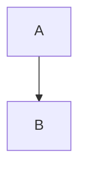

1.xinzi fuli

2.gongsiyingliqingkuang

3.

```
'''mermaid
graph TD
   A --> B
   '''
```

~~~mermaid
```mermaid
graph 方向
节点以及节点连线（定义和连线步骤可以分开）
（样式调整）
```
~~~

```mermaid
graph TD
  A --> B
```


```mermaid
graph LR
  A-->B
```


