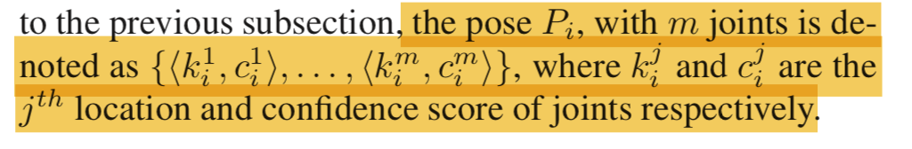
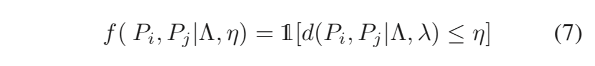
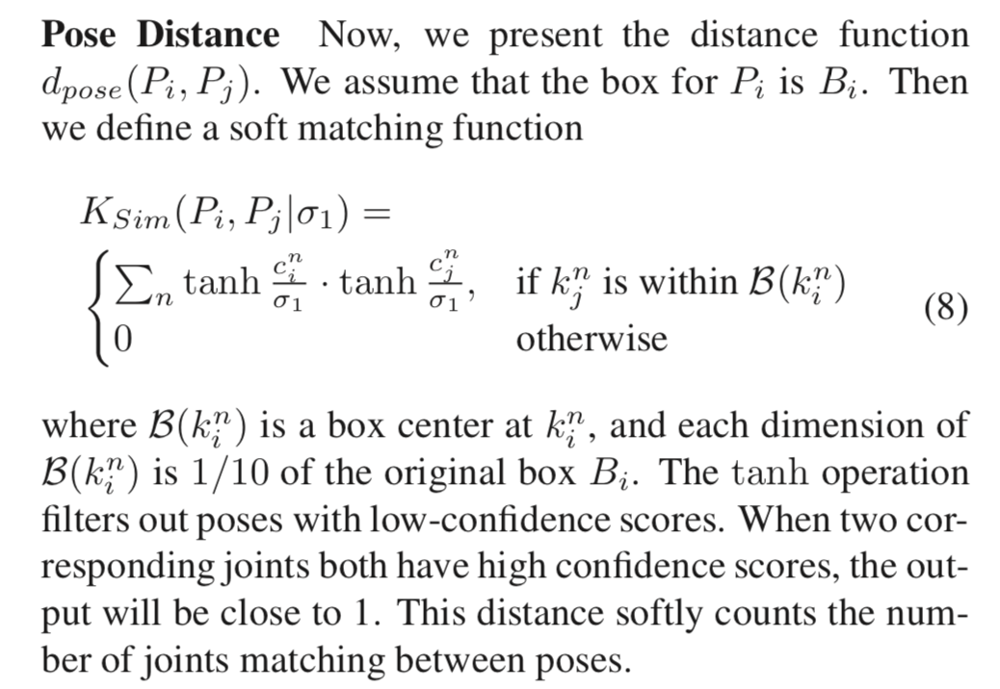
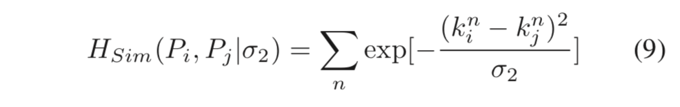
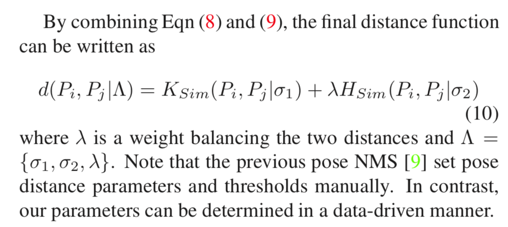
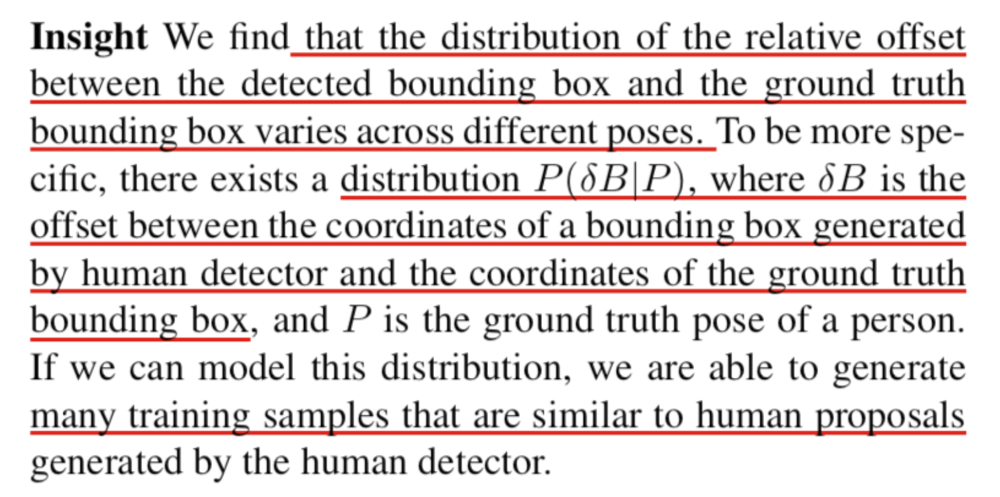
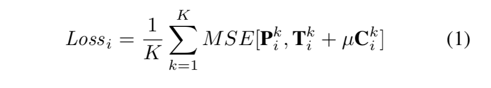

AlphaPose

| 开源系统              | 准确率 | 平均速度 |
| :-------------------- | :----- | :------- |
| Openpose（CMU）       | 60 mAP | 12 FPS   |
| Mask-RCNN（Facebook） | 67 mAP | 5 FPS    |
| Alphapose（SJTU）     | 71 mAP | 20 FPS   |

为了在兼顾速度的同时保持精度，**新版AlphaPose提出了一个新的姿态估计模型**。模型的骨架网络使用 ResNet101，同时在其下采样部分添加 SE-block 作为 attention 模块——已经有很多实验证明，在 Pose Estimation 模型中引入 attention 模块能提升模型的性能，而仅在下采样部分添加 SE-block 能使 attention 以更少的计算量发挥更好的效果。

除此之外，使用 **PixelShuffle + Conv** 进行3次上采样，输出关键点的热度图。传统的上采样方法会使用反卷积或双线性插值。而使用 PixelShuffle 的好处在于，在提高分辨率的同时，保持特征信息不丢失。对比双线性插值，运算量低；对比反卷积，则不会出现网格效应。

在系统架构方面，新版 AlphaPose 采用**多级流水**的工作方式，使用多线程协作，将速度发挥到极致。

AlphaPose 系统目前在COCO的 Validation 集上的运行速度是 20FPS（平均每张图片4.6人），精度达到71mAP。 在拥挤场景下（平均每张图片15人），AlphaPose系统速度仍能保持 10FPS 以上。

--------

背景：复杂环境中的多人姿态检测是非常具有挑战性的。现在最好的人体检测算法虽然已经得到了很好的效果，但是依然存在一些错误，这些错误会导致单人检测任务（SPPE）失败，尤其是那些十分依赖人体框检测结果的。

### RMPE

如图3所示。首先通过目标检测算法，得到人体的区域框。然后将该区域框输入到STN+SPPE模块中，自动检测人体姿态。再通过PP-NMS进行refine。在训练过程中，使用Parallel SPPE来避免局部最优并进一步提升SSTN的效果。设计PGPG结构来增强已有的训练集。

**parametric Pose NMS**

* Why nms:

因为human detectors 可能会产生多余的检测，那么自然的也会有多余的pose estimations,NMS就是为了去除这些冗余。 和通常的NMS差不多的过程，就是先在里面选择score最高的那个，然后删除掉和其离的比较近的，一直重复这个过程直到没有。

* 删除准则

  什么样的才算离的近，这里就有一个距离的定义问题，或者相似度的一个充度量，按Paper里面是公示（7）

  

\eta 是个阈值，距离小于\eta的时候f取1，代表pi应该被deleted， 否则取0， \Lambda是d的参数

* pose distance

  

* part 之间的空间距离

  

因为有4个参数，一起优化的太难了，所以现在的方法是每次优化两个参数，固定其他两个，直至收敛.

**PGPG **

对于SSTN-SPPE模块而言，因为需要网络来适应由human detector 产生的 可能并不太完美的bbox proposals，所以很有必要来做数据增强。否则的话，因为测试阶段仍然是需要human detector的，可能会导致效果不太好。一个自然的想法是，训练时直接使用human detector产生的bbox。 现在有了ground truth的pose，再加上human detector又会对每个人产生bbox， 这样的话就会有很多的training proposals了，并且因为它们都是human detector的输出，

* gt的pose

即希望学得那个分布P，是proposals与gt-bbox之间的偏移相对于gt pose的条件分布。

* Proposals Generation

在SSTN+SPPE的训练阶段，对于训练样本中每个带注释的姿势，我们首先查找相应的原子姿态a。然后我们根据P（δB| a）通过密集采样产生额外的偏移，以产生增强训练的proposals。

###Poseflow

复杂场景下多人关节姿态跟踪，论文设计了一个在线的优化网络建立帧间姿态关系，并形成姿态流，此外设计了一个姿态流非极大值抑制减少冗余姿态流，重新建立时间上不相交姿态的联系。

Pose Flow Building

Pose Flow NMS

### crowdpose

joint-candidate single person pose estimation(SPPE)

global maximum joints association

1，提出一种创新的方法用来处理拥挤场景的姿态估计问题

2，收集了一个拥挤场景的姿态估计数据库

我觉得文章最主要的地方在于提出target joints和interference joints这个概念,因为以往从来没想过, 都是直接保留target joints, 非target joints就直接抑制掉了.文章保留了这两类点,并且打上不同比重的label, 从而让网络有意的去学习这两类点,最后再通过构建图的方法来求得最优解.

JC sppe: jc sppe输入为human proposal ,输出是一组heatmap

通过全局方式，利用干扰关节和其他的human proposals

heatmap loss:

Ti是目标关节的heatmap, Ci是干扰关节的heatmap。u=0.5是干扰关节的衰减因子

#### pyramid residual modules

论文主要有以下贡献：

1、提出Pyramid Residual Module，金字塔残差模块，它通过学习DCNNs中的特征金字塔来增强深度模型的尺度的不变性，而模型复杂度只有很小的增加。

2、研究具有多个输入或多个输出分支图层的DCNNs初始化问题，提出有效的初始化方案，可用于inception和ResNets等模型。

3、解决由identity mapping引起的激活方差积累的问题。